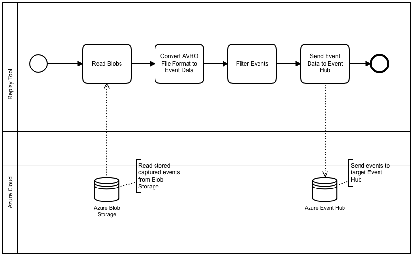

# Event Hub Replay Tool
The Replay Tool allows you to easily restore data from a blob storage to an event hub so that any time period can be restored from the blob storage. The Event Hub itself allows you to configure a recovery, but it is limited to 7 days. In order for the data to end up in the Blob Storage, the [Capture Events Feature](https://docs.microsoft.com/de-de/azure/event-hubs/event-hubs-capture-overview) must first be activated in the Event Hub. Theoretically the tool can be used on any machine, but it is recommended to use a virtual machine in Azure to achieve a high performance upload when publishing to the event hub.

## Workflow
At first all blobs are read from the Azure Blob Storage according to the restorePath parameter set in the application.properties file. Then the downloaded blobs are transformed from the [Avro file format](https://de.wikipedia.org/wiki/Apache_Avro) into the Event Data format of the Event Hub. All events are then filtered according to a specified regular expression. The result is sent to the desired event hub.

## Configuration
The application is configured via a properties file. The parameters are explained in detail:

### Blob Storage Configuration
* **azure.storage.account.name**: Name of the storage account
* **azure.storage.account.key:** Key for accessing the storage account
* **azure.storage.container:** Name of the Blob Storage Container
* **azure.storage.num_partitions:** The Capture Event feature saves the blob for each partition. Number of configured partitions in the event hub
* **azure.storage.log.level:** The log level that the Azure Storage API should use (Default: WARNING)
* **azure.storage.log.duration_slow_ms:** Response time in ms from which the Azure Storage API issues a warning for the web request (default: 2000ms)
* **azure.storage.restorePath:** Folder path in the blob storage to be used for the restore. See also section Folder Path Storage.
* **azure.storage.client.threads:** Number of threads to retrieve the blobs from the Azure Storage.
* **azure.storage.event.body.filter_regex:** Filter to only reload certain events into the Event Hub.  Messages that do not fulfill the regex are discarded. If no filter is specified, no filtering takes place.

### Event Hub Configuration
* **publish.eh.event.read_properties:** Indicates whether the original event properties should be used (Default: true)
* **publish.eh.event.use_partition_key:**  Indicates whether the original partition key should be read from the stored event and use it for publishing. Batch processing is not possible in this mode. (Default: false)
* **publish.eh.event.use_partition_sender_batch:** Specifies whether messages are returned to the original partition specified by the storage. (Default: true)
* **publish.eh.event.batch_size:** Batch Size for sending events to the event hub (default: 1000)
* **publish.eh.con_string1:** Connection String to Event Hub
* **publish.eh.threads:** Number of threads to send events to the Event Hub

### Folder Path Blob Storage
The Capture Event feature saves all blobs in the following folder structure by default:

`{Namespace}/{EventHub}/{PartitionId}/{Year}/{Month}/{Day}/{Hour}/{Minute}/{Second}`

The path specifies the granularity of replaying the events. If, for example, you want to replay all events from 2019/01/30 at 8 o'clock, the following folder should be set:

`sample_namespace/sample_eventhub/{PartitionId}/2019/01/30/08`

